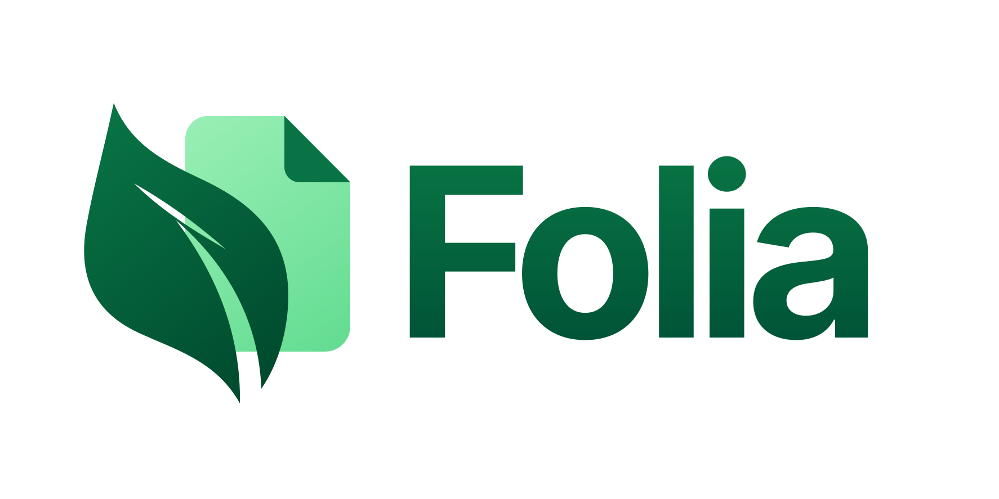

# Folia

<p align="center">
  
</p>

Folia is a reproducible, self-hosted collaborative workspace distribution. It
packages a tested combination of the public AppFlowy Cloud, AppFlowy Web, and
AppFlowy Auth sources with a small deployment layer.

The initial baseline is the exact application source used by a working NAS
deployment on 2026-08-19. It intentionally uses AppFlowy Web 0.10.7 because the
newer public Web API is not compatible with the selected public Cloud revision.

> Folia is an independent community project. It is not affiliated with
> AppFlowy, Notion, or the unrelated PaperMC project also named Folia.

## Repository layout

| Path | Purpose |
|---|---|
| `apps/web` | Pinned Web client and the deployed compatibility patches |
| `services/cloud` | Pinned Cloud server and the deployed Board grouping patch |
| `services/auth` | Pinned AppFlowy Auth source |
| `deploy/compose` | Pull-only production Compose and an opt-in build override |
| `tools/url-migrator` | Semantic migration tool for stored deployment URLs |
| `docs` | Architecture, provenance, development, deployment, and releasing |

## Baseline

| Component | Upstream revision |
|---|---|
| Cloud | `581f123d48008dd4453be85a5133c554e34a51cb` |
| Web | `d0704de22c6521a17d04db76888c869b7b218026` (`0.10.7`) |
| Auth | `43770901225d5fb6d2a262e62412e1c223ffd85c` (`0.8.0`) |

The upstream histories are retained as Git subtrees. See
[`docs/BASELINE.md`](docs/BASELINE.md) for the deployed image evidence and the
exact local modifications.

## Build and release

GitHub Actions is the official image build and publication path. The root CI
workflow runs for pull requests and `main`, detects which image inputs changed,
and builds only those images. These routine builds never push images. A manual
workflow run can also build one selected component without using the NAS.

A `vX.Y.Z` tag starts the release workflow. It verifies that
the release metadata declares `X.Y.Z`, then builds all five images in parallel
for `linux/amd64` on `ubuntu-24.04`. Only after every candidate succeeds does a
promotion job create the `X.Y.Z` and commit SHA tags in GHCR. GHCR is the only
supported registry for Folia-built images, and Folia does not publish `latest`
tags. See [`docs/RELEASING.md`](docs/RELEASING.md) for the complete release
procedure.

The local build and publish scripts remain available for focused troubleshooting
and emergencies; they are not the normal release path. See
[`docs/DEVELOPMENT.md`](docs/DEVELOPMENT.md).

## Deploy on a NAS

The production Compose file has no `build` sections. The NAS only pulls images
and runs containers:

```bash
cd deploy/compose
bash scripts/init-env.sh
# Edit .env and use one complete version published by the release workflow.
bash scripts/deploy.sh
```

Configure all five `FOLIA_*_IMAGE` values from one successfully completed
version release. Public GHCR packages can be pulled anonymously; private
packages require `docker login ghcr.io` on the NAS. Never deploy a partial
release or mix versions from different releases.

Persistent state is stored under the repository-level `data/` directory and is
excluded from Git. Backups are written to `backups/` and are also excluded.

Read [`docs/DEPLOYMENT.md`](docs/DEPLOYMENT.md) before moving an existing
installation. Open risks inherited by this baseline are listed in
[`docs/KNOWN_ISSUES.md`](docs/KNOWN_ISSUES.md).

## License

Folia's integration and modifications are distributed under AGPL-3.0. The
vendored source directories retain their original copyright and license files.
AppFlowy Auth remains MIT-licensed. See [`NOTICE`](NOTICE) for attribution and
component boundaries.
